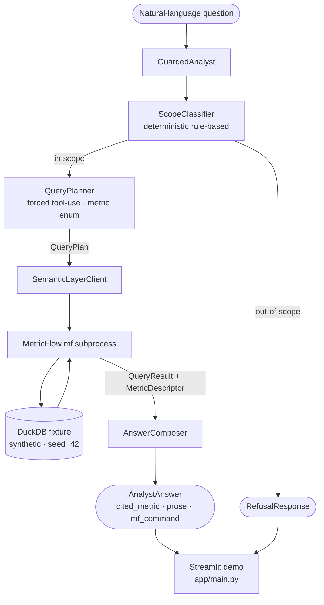

# llm-analyst

**A governed natural-language analytics agent — every query routed through MetricFlow, every answer citing the metric definition that produced it. No raw SQL. Ever.**

---

## The problem

Text-to-SQL LLMs hallucinate metric definitions. Ask two analysts to define "default rate" and you get two answers; ask an LLM and you might get a third — invented, uncited, inconsistent with the data model.

The usual mitigation is prompt engineering: tell the LLM what a metric means and hope it stays inside the lines. That doesn't work at scale. The LLM can always drift.

This project takes a structural approach: a governed semantic layer (MetricFlow + vendored YAML) defines every metric once. The LLM is not allowed to write SQL. It is only allowed to call one function — `SemanticLayerClient.query` — with a metric name from an explicit allowlist. Out-of-catalog names are rejected at the API schema level before any governance code runs. The LLM cannot invent a metric definition because there is no code path through which it could issue one.

---

## Architecture



**Three independent enforcement layers** ensure a metric can never be invented:

1. **Schema enum** — the `plan_query` tool's `input_schema` lists `GOVERNED_METRICS` as a JSON-schema `enum`; the API rejects any out-of-catalog name before governance code runs.
2. **Python type** — `GovernanceError` is a distinct exception type, not a string match; `GuardedAnalyst` catches it by type and routes to `RefusalResponse`.
3. **Package encapsulation** — the raw `Analyst` is not exported from the `llm_analyst` package; `GuardedAnalyst` is the only public entrypoint.

Any one layer failing still leaves two intact. All three must fail simultaneously for governance to break.

---

## Key features

| Feature | Detail |
|---|---|
| Governance-by-construction | No raw SQL path exists in the codebase. Metric allowlist enforced at API schema level. |
| Eval harness | 22-question set (14 in-scope + 8 out-of-scope), metric-match scorer, 90% CI accuracy gate. |
| Streamlit demo | Interactive chat UI — no API key required, runs on the same deterministic mock as CI. |
| Deterministic CI | `MockLLMClient` mirrors the same plan registry as the eval suite. Zero live API calls in CI. |
| Vendored semantic layer | 5 MetricFlow YAML files + committed DuckDB fixture; `git clone && make ci` works with no external repos. |
| Security hardening | Bandit SAST, pip-audit CVE scan, and Gitleaks secret scan on every PR. |

---

## Demo

Run the Streamlit app locally — no API key needed:

```bash
git clone https://github.com/OmerTDK/llm-analyst.git
cd llm-analyst
uv sync
uv run dbt deps --project-dir platform
streamlit run app/main.py
```

The sidebar shows the 7 governed metrics. The chat routes every question through the full `GuardedAnalyst` pipeline and displays the `cited_metric`, the underlying MetricFlow command, and the returned data table alongside the prose answer. Out-of-scope questions receive a `RefusalResponse` with an explanation.

---

## Results

| Metric | Value |
|---|---|
| Test count | 133 passing (14 live tests deselected in CI) |
| CI runtime | ~163 s (MetricFlow subprocess overhead; session-scoped client) |
| Governed metrics | 7 |
| Eval question set | 22 questions |
| Eval baseline accuracy | 22 / 22 = 100% (deterministic mock eval) |
| CI accuracy threshold | 90% |
| Fixture size | 6.5 MB (synthetic loan book, seed=42) |
| `origination_volume` (pinned) | 52,960,250.00 |
| `default_rate` (pinned) | 47 / 1500 = 0.0313... |

---

## Tech stack

| Layer | Technology |
|---|---|
| Semantic layer | MetricFlow 0.13.x (dbt-metricflow) |
| Query engine | DuckDB 1.2.x (synthetic fixture, committed to repo) |
| LLM protocol | Anthropic tool-use API (forced tool-use, `plan_query` schema) |
| Demo UI | Streamlit 1.45+ |
| Linting | Ruff |
| Dependency management | uv |
| CI | GitHub Actions (lint · fixture SHA · tests · Bandit · pip-audit · Gitleaks) |

---

## Quickstart

```bash
git clone https://github.com/OmerTDK/llm-analyst.git
cd llm-analyst
uv sync                                   # install dependencies
uv run dbt deps --project-dir platform   # install dbt packages (needed by MetricFlow)
make ci                                   # lint + fixture SHA check + full test suite (~163 s)
streamlit run app/main.py                 # launch the demo
```

To verify the vendored semantic YAML has not drifted from upstream (requires the source platform repo):

```bash
make check-semantic-drift CDP=/path/to/credit-data-platform
```

---

## Design decisions

| ADR | Decision |
|---|---|
| [ADR-0001](docs/adr/0001-semantic-layer-consumption-mechanism.md) | Vendor the semantic layer (YAML + DuckDB fixture) rather than import or submodule — keeps the repo standalone-runnable |
| [ADR-0002](docs/adr/0002-analyst-core-query-planning.md) | Forced tool-use (`tool_choice`) over JSON-mode or Pydantic-first — structural constraint, not instructional |
| [ADR-0003](docs/adr/0003-guardrail-strategy.md) | Deterministic rule-based `ScopeClassifier` over LLM-based — no LLM call consumed before the governance boundary is applied |
| [ADR-0004](docs/adr/0004-eval-harness.md) | Metric-match scoring (not exact-match) — the metric is the governance-critical assertion |
| [ADR-0005](docs/adr/0005-demo-ui.md) | Streamlit over FastAPI + React — single-file deploy with zero frontend build step |

The core decision running through all five ADRs: **governance-by-construction beats governance-by-convention**. Every API surface that could allow a raw SQL path or an ungoverned metric was identified and closed structurally — by type system, package boundary, or schema constraint — not by documentation or discipline.

---

## Project structure

```
src/llm_analyst/
├── guardrail/        # GuardedAnalyst, ScopeClassifier, RefusalResponse — public API
├── analyst/          # Analyst, QueryPlanner, AnswerComposer — internal; not exported
├── semantic_client/  # SemanticLayerClient (mf subprocess wrapper)
├── llm/              # LLMClient interface + AnthropicLLMClient + MockLLMClient
└── evals/            # EvalRunner, scorer, question loader

app/                  # Streamlit demo (main.py + demo plan registry)
evals/                # question_set.yaml (22 questions)
platform/             # Vendored MetricFlow YAML + backing dbt models
tests/                # 133 tests; fixtures/semantic_fixture.duckdb (committed)
docs/adr/             # Five ADRs (one per build phase)
```

---

## License

Apache-2.0. See [LICENSE](LICENSE).
